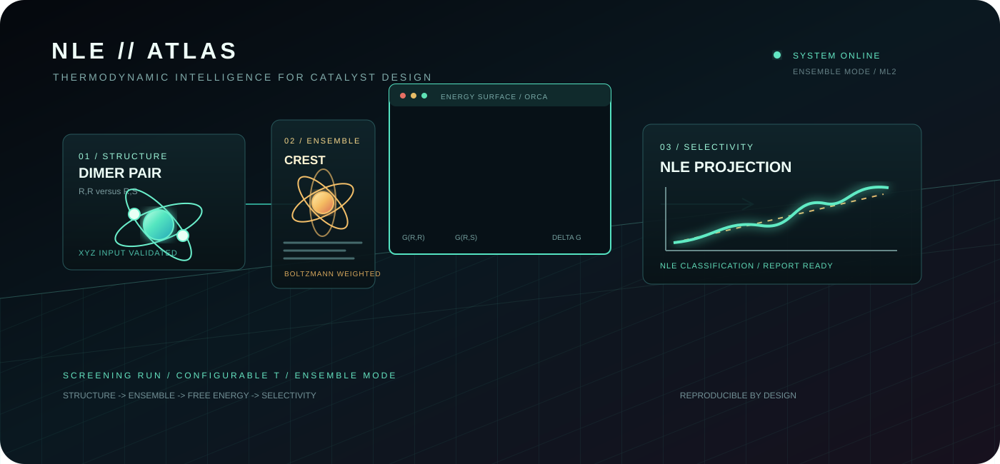

# NLE Predictor

<p align="center">
  
</p>

<p align="center">
  <strong>Computational discovery of non-linear effects in asymmetric catalysis.</strong><br>
  From dimer structures to thermodynamic free energies and predicted product ee.
</p>

<p align="center">
  
  
  
  
</p>

## Overview

NLE Predictor automates a computational screening workflow for asymmetric
catalyst systems that may display a positive non-linear effect. It compares
homochiral (`R,R`) and heterochiral (`R,S`) catalyst dimers, estimates their
relative thermodynamic stability, and propagates that difference through a
Kagan-style mass-balance model.

The result is a reproducible set of quantum-chemistry files, thermodynamic
metrics, a catalyst-ee/product-ee data table, and a publication-ready plot.

## Workflow


### What is calculated

For each catalyst ee value, the model solves the coupled monomer balances

$$
C_R = M_R + 2K_{homo}M_R^2 + K_{hetero}M_RM_S
$$

$$
C_S = M_S + 2K_{homo}M_S^2 + K_{hetero}M_RM_S
$$

and reports the product ee implied by the active monomer pool. The relative
free energy is converted using the configured temperature and
$R = 0.00198720425864083$ kcal mol$^{-1}$ K$^{-1}$.

## Quick start

### 1. Install Python dependencies

```bash
python -m pip install -r requirements.txt
```

### 2. Install computational chemistry software

Install CREST with xTB and ORCA according to their respective documentation.
Both executables must be available on `PATH`:

```bash
crest --version
orca
```

### 3. Run a real calculation

```bash
python nle_predictor.py \
  --rr inputs/dimer_RR.xyz \
  --rs inputs/dimer_RS.xyz \
  --outdir calc_outputs \
  --solvent toluene \
  --cores 8
```

### 4. Run the pipeline demonstration

The mock mode exercises file generation, parsing, numerical solving, CSV
export, and plotting without running CREST or ORCA:

```bash
python nle_predictor.py --mock --outdir calc_outputs
```

Mock energies are synthetic and must not be interpreted as chemical results.
When required binaries are unavailable, the current script automatically uses
the same mock path and logs that decision.

## Inputs

The `--rr` and `--rs` arguments accept XYZ files containing the homochiral and
heterochiral catalyst dimers. The generated ORCA input currently assumes a
neutral, singlet system (`Charge 0`, `Mult 1`); edit the input-generation
parameters before using charged or open-shell complexes.

| Option | Default | Purpose |
| --- | --- | --- |
| `--rr` | `inputs/dimer_RR.xyz` | Homochiral dimer structure |
| `--rs` | `inputs/dimer_RS.xyz` | Heterochiral dimer structure |
| `--temp` | `298.15` | Temperature in kelvin |
| `--solvent` | none | CREST solvent and ORCA CPCM solvent |
| `--khomo` | `1e5` | Absolute homochiral association constant |
| `--functional` | `B3LYP` | ORCA density functional |
| `--basis` | `def2-SVP` | ORCA basis set |
| `--dispersion` | `D4` | Dispersion correction |
| `--cores` | `4` | CREST and ORCA parallel workers |
| `--outdir` | `calc_outputs` | Calculation and result directory |
| `--mock` | off | Use deterministic synthetic chemistry outputs |

## Outputs

Every generated artifact is placed below `--outdir`:

```text
calc_outputs/
|-- crest_dimer_RR.xyz/
|   |-- crest.out
|   `-- crest_best.xyz
|-- crest_dimer_RS.xyz/
|   |-- crest.out
|   `-- crest_best.xyz
|-- opt_RR.inp
|-- opt_RR.out
|-- opt_RS.inp
|-- opt_RS.out
|-- nle_results.csv
`-- nle_curve.png
```

- `nle_results.csv` contains catalyst ee (%) and product ee (%), ready for
  OriginLab, GraphPad Prism, Excel, or custom analysis.
- `nle_curve.png` compares the predicted NLE against the ideal linear baseline
  at 600 dpi.
- `opt_*.inp` and `opt_*.out` preserve the ORCA calculation inputs and logs.
- `crest_*/crest_best.xyz` preserves the conformer passed to ORCA.
- Console logs report $G_{RR}$, $G_{RS}$, relative stability, `K_homo`, and
  `K_hetero`.

## Reproducibility notes

- Record the exact CREST/xTB and ORCA versions used for publication work.
- Preserve the input XYZ files, command line, solvent, temperature, functional,
  basis, dispersion model, and core count with the generated `calc_outputs/`.
- Review ORCA convergence and frequency results before accepting a free energy.
- The built-in numerical solver reports a warning and uses an approximate
  fallback if a mass-balance point does not converge.
- Dummy hydrogen structures are created only when requested input files are
  missing; replace them with chemically meaningful structures for real work.

## Project layout

```text
.
|-- nle_predictor.py    # Workflow, thermodynamics, solver, export, plotting
|-- requirements.txt    # Python runtime dependencies
|-- README.md           # Usage and reproducibility documentation
`-- assets/
    `-- nle-workflow.svg # Animated project visual
```

## Scope

This project is a workflow scaffold for computational screening. It does not
replace chemical validation, conformer quality assessment, ORCA convergence
review, or experimental measurement. Treat predicted NLE curves as hypotheses
to prioritize, not as standalone evidence of catalytic performance.